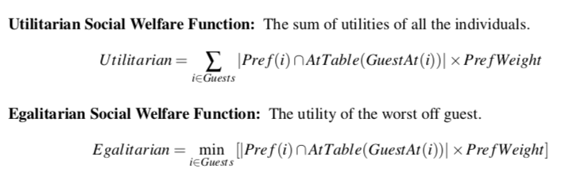

## Project 3: Constraint Assignment

Note that this project will make use of [MiniZinc](https://www.minizinc.org/).  You will need to download and install [MiniZinc](https://www.minizinc.org/) first.

I have assembled a number of examples of MiniZinc programs and PDFs of my old class where I go into greater detail on various aspects of efficient modeling.  [All these resources are available here](https://drive.google.com/open?id=1vf_0VivlRM1PABX8Jyza7BQWMozTdiH1).

### The Assignment

We want to find out if we can seat all of our friends and relatives at our sister's upcoming wedding. Mom says money is a little tight so we need to make sure all the tables that we will order will at least have some people at them.  Every individual, family, or couple that received an invitation should be seated together.  Additionally, each person could suggest people that they would prefer to sit with.  Since this is so important to Mom we want to maximize the happiness she gets out of seeing all her friends and family sitting together happily at the wedding. For this assignment we are going to encode the problem as a constraint programming problem and find solutions so that everyone can have a fun and **happy** time.

#### Formal Problem Description

We want to maximize the following two objective functions.

### What To Turn In!

Turn in through [Canvas](https://tulane.instructure.com/). You should submit a Zip file that contains ...   

Name the output capture `Lastname.Autograder.txt/pdf/docx`.

You should also include answers to the *written portion* questions below in your zip file.  This should be named `Lastname.WrittenAnswers.pdf/docx/txt`.

You should rename the folder (before zipping it) to `Lastname.Project2`. Please make sure to zip and submit **only the files specifically listed here**.  You are not to modify any other files than the ones listed here, if you do we will not be able to run your code and you will lose points.

### Grading Rubric

Note that for all of these projects simply passing the autograder is not sufficient to ensure full credit.  We will include comments to why points were taken away -- if you are still confused Arie and Dr. Mattei are available to talk to you and provide explanations.  
We expect all code to be written in a professional manner. That means there are comments where there needs to be, that the code is written in a general way that is (reasonably) efficient, and that you use naming conventions that others can understand.  If we open your code and we can't understand it, you will lose points even if it works.

* (10 Points) *Professionalism*: You have written code that is interpretable -- it contains comments where needed to understand, variable names are reasonable, and code that is reasonable and efficient.  You have followed directions to turn in the file, clearly labeling everything.  You have cited all sources and how you used them.

* (20 Points) *Written Portion.* Several of the questions ask you to investigate the behavior of the algorithms in various settings.  Include a file with **~1 paragraph** answers to the following questions.

* Total Score: 100